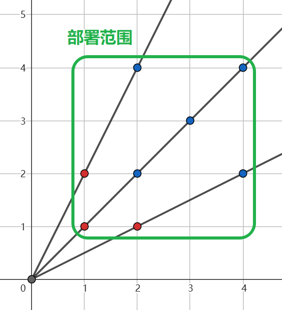

# Problem. Deep Spinal-cord Signals Protocol

<!-- 「」 -->

>  为了抵抗「寰宇蝗灾」，「格拉默」共和国秘密研发了一种人形战斗机甲——战略强袭装甲 (Strategic Assault Mech , S.A.M. )，「萨姆」，同时制造了一批经过先天基因改造的战士——格拉默铁骑。
> 
> 这其中的很多历史已不可考。不过经过历史学家 Stelle 对目前唯一尚存的「格拉默铁骑」的研究，她提出了数个理论。这些理论串联了大量已有历史资料，揭开了这古老帝国的无数秘辛。
> 
> Stelle 的论文《 Firefly is All You Need 》中，提到了一个名为「深髓信号传输协议」( Deep Spinal-cord Signals Protocol, DSSP ) 的系统，它是机甲与驾驶员之间进行沟通的重要桥梁。论文中及其详尽地写出了它的工作原理及其对驾驶员身体的影响，为后世对人形战斗机甲的研究开拓了良好的基础。


$$
Figure : 格拉默铁骑 Firefly
$$

「深髓信号传输协议」的组成十分复杂，我们今天仅仅研究其中最简单的一部分——激光雷达。

相比与其他环节严谨的设计，「萨姆」的激光雷达显得十分简陋且漏洞百出。它的核心是一个不断旋转的激光发射器，通过不同波段的回波来产生目标的深度信息。不同于当前普遍采用的超弦重子震动仪，这种激光雷达的弊端是显而易见的。

具体的，在一个 $n \times n$ 的正方形平面内，激光雷达架设在 $(0,0)$ 点，它会向第一象限内部发射一条扫描线，并获取扫描线上靠原点最近的目标的深度信息。扫描线会在第一象限绕原点周期性地旋转，这种线性扫描会使同一个直线上的多个目标中，只有最靠近原点的目标被探测到。

为了研究这种情况，你需要在上述平面的**整数点**上部署 $k$ 个目标，并使得被探测到的目标尽量小。

形式化地，将你部署的所有目标记为集合 $S = \{(x_i,y_i) | \forall i \in [1,k]\}$ ， 首先需要满足 $\forall i \in [1,k], 1\le x_i,y_i \le n 且 x_i,y_i \in N^*$。接下来，对于任意一条扫描线 $y = qx,q\in R,q \le 0$ ，则有目标 $(x_i,y_i)$ 被本条扫描线探测到当且仅当 $y_i = q x_i 且 \forall j \in [1,k], 若有 y_j = q x_j ，那么 \sqrt{(x_i^2+y_i^2)} < \sqrt{(x_j^2+y_j^2)}$ 。

为了检查你的部署方案，你需要输出这 $k$ 个目标中有几个目标被探测到。

$^+$ 参考样例解释以更好理解题意。

## Input

本题包含多组测试样例。

第一行一个整数 $T$，$1 \le T \le 1 \times 10^3$，表示测试样例的数量。

接下来 $T$ 行，每行包含两个整数 $n, k$，$1 \le n \le 1 \times 10^6$，$1 \le k \le n \times n$，表示正方形平面的大小，和需要部署的目标的数量。

## Output

对于每组测试样例，输出一行一个整数，表示被探测到的目标的数量。

### Input Example 1

```plaintext
2
8 7
4 8
```

### Output Example 1

```plaintext
1
3
```

### Note



如图，上述样例的第二个测试样例中，$(1, 1), (1, 2), (2, 1)$ 三个目标被探测到，以此隐藏了 $(2,2),(2,4),(3,3),(4,2),(4,4)$ 的五个目标，因此输出为 $3$。

<!-- deep spinal-cord signals protocol

Fyrefly Type-IV Strategic Assault Mech -->
