# Problem. Imaginary Tree (StarRail Version)

$\begin{array}{l l}Time \; limit \; per \; test & :  1 seconds\\ Memory \; limit \; per \; test &:  512 megabytes\\Input& : standard\;  input \\Output & :standard\;  output \\ \end{array}$

「虚数之树」学说是现今学术界普遍接受的一种宇宙理论。

> 该学说将不同时空的不同世界比作树状结构：每一株枝干，都是一种世界存在的形式；每一片花叶，都是它们在时间维度中留下的现在与曾经。
> 
> 树冠因汲取时空维管中无主的虚数能量，而始终存在动态的结构——新芽生长，枯叶脱离，无垠宇宙中上演着无数的诞生与终结…将宇宙结构比喻为树，或许是一种将「虚数之树」视为生命的态度。

<!-- 早在开拓星神阿基维利巡代星海的古老岁月之前，人们已经将视线投入天穹之上的浩瀚银河。

怀揣着对未知的无尽好奇，无数文明开始了星际探索之旅。但无一例外地，他们的尝试均以失败作结。 -->

在我们的理论中，「星轨」是一种虚数能量的流动，借助它可以穿越空间，打破光速的束缚。但是由于裂界的影响，宇宙中的「星轨」早已断绝。

不过幸运的是，根据我们的研究，只需要建设两个庞大的结构——「差分机」和「杠杆」，即可重塑一条「星轨」。

选定两个星系，建设并在恰当的时间启动「差分机」和「杠杆」之后，「差分机」对应在「虚数之树」上的节点便会产生一条虚数能量射线，经过「杠杆」后继续在「虚数之树」上延伸，直到无法再延伸。由于虚数能量的特殊性质，**这条射线会沿着它在「虚数之树」上可能经过的最长路径延伸**，射线经过的边上就会形成新的「星轨」。

这个计划耗资巨大，因此 Stelle 需要你的帮助，帮助她计算每种决策的收益。

**形式化地**，用一棵有 $n$ 个节点的树来描述「虚数之树」。

接下来会有 $q$ 次询问，每次询问给出两个个节点 $u$ 和 $v$，表示在节点 $u$ 处建设「差分机」，并且在节点 $v$ 的地方建设「杠杆」。

从节点 $u$ 出发，经过节点 $v$ 的**最长路径长度**即为所求的「星轨」长度。

$^+$参考样例解释以更好地理解题意。

## Input

第一行一个整数 $n$，$1\le n\le 10^5$ ，表示「虚数之树」的节点数。

接下来 $n-1$ 行，每行两个整数 $a,b$， $1\le a,b\le n$ 表示「虚数之树」上的一条边。

接下来一行一个整数 $q$，$1\le q\le 10^5$ ，表示询问次数。

接下来 $q$ 行，每行两个整数 $u,v$，表示每次询问，保证 $u \neq v$。

## Output

对于每个询问，输出一行一个整数，表示「星轨」的长度。

### Input Example 1

```text
5
1 2
1 3
3 4
3 5
4
1 5
5 1
3 2
4 3
```

### Output Example 1

```text
3
4
3
4
```

### Note

如下图的虚数之树：



在上述样例的最后一个询问中，在节点 $4$ 处建设「差分机」，在节点 $3$ 处建设「杠杆」，则「星轨」延伸到节点 $3$ 时，会选择沿 $3 \to 1 \to 2$ 延伸，而不是 $3 \to 5$，因此最终答案为 $4$。
