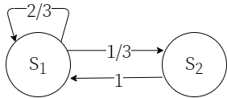

# Markov chain

马尔可夫链（英语：Markov chain），又称离散时间马尔可夫链（discrete-time Markov chain），因俄国数学家安德烈·马尔可夫得名。它描述了一个状态空间中经过从一个状态到另一个状态的转换的随机过程。

形式化地，对于随机变量序列
$X_1 ,X_2,...,X_n$ 定义条件概率分布$P_r(X_1=x_1,...,X_n = x_n) > 0$ 则由$X_i$构成的可数集作为状态空间。

一般**由一系列有向图描述马尔可夫链**。其中边$(U,V)$有权重$P_{U,V}$，意为从符号$U$转移至符号$V$的概率，即$P_r(X_{n+1}=U|X_n=V) = P_{U,V}$

下图是一个二阶马尔可夫信源的状态转移图。

对于符号$S_1$，有$\frac{2}{3}$ 的概率转移到符号$S_1$，有$\frac{1}{3}$ 的概率转移到符号$S_2$。

可以用信息熵（entropy）来描述一个信源的复杂程度。其定义为$H(X) = E(I(X))$，即符号集合X的自信息量的期望。

对于一个马尔可夫信源，其熵一般用极限熵$H_\infin(X)$描述。

$$
H_\infty = lim_{N \rarr \infin }H(X_N/X_1,X_2,...,X_{N-1})
$$

直观地来看，极限熵为利用以上信源生成无限个符号后的平均熵，计算时，**我们一般使用马尔可夫信源各个符号的稳态概率求解极限熵**。

即
$$ 
\begin{align}

H_\infty & = \sum_{i = 1}^{r^n}\sum_{j = 1}^{r^n} P(X_N = x_i) P(X_{N-1}=x_j | X_{N-1}=x_i) I(X_{N-1}=x_j | X_{N-1}=x_i) \\
& = \sum_{i = 1}^{r^n} W_i H(X|x_i)
\end{align}

$$

其中稳态概率矢量$W$的定义为：对于所有的转移概率$p_{i,j}=P_r(X_{n+1} = x_i | X_{n} = x_j)$，有$\sum_i^{r^n} W_i p_{i,j} = W_j$成立。

给定一个描述马尔可夫信源的有向图，你的任务是求出这个信源的极限熵$H_\infin (X)$

## Input

第一行为一个整数$T$，代表测试样例数量。

对于每个测试样例：

第一行为三个整数$n,m$满足$1 \le n,m \le 10^3$，代表马尔可夫信源的状态转移图上有$n$个符号、$m$个有向边。

接下来的m行，每行包含四个整数$u,v,f,d$，其中$u,v$表示一条从符号$u$指向符号$v$的边，$f,d$以分数形式表示了这条边上的转移概率为$\frac{f}{d}$。满足$1 \le u,v \le n,0 < \frac{f}{d} \le 1$

## Output

对于每个样例，输出两个整数，中间用空格间隔，代表以分子分母形式表示的答案。

## Note

   
